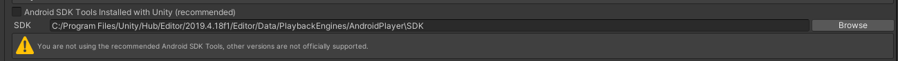
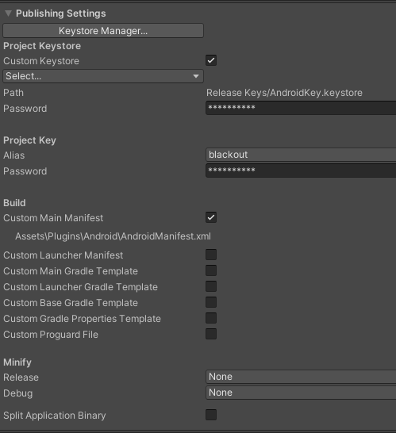

# Build Process

## Links
- [Unity Cloud Build Configuration](https://dashboard.unity3d.com/organizations/17867078423645/projects/9e85a63f-3908-4e07-a8e2-861b5bb89a8b/cloud-build)
- [Unity Cloud Build History](https://dashboard.unity3d.com/organizations/17867078423645/projects/9e85a63f-3908-4e07-a8e2-861b5bb89a8b/cloud-build/history)
- [Content Delivery Buckets](https://dashboard.unity3d.com/organizations/17867078423645/projects/9e85a63f-3908-4e07-a8e2-861b5bb89a8b/cloud-content-delivery)

## Build Targets
Our current builds target the following platforms:
- Desktop Platforms
  + Windows 32-bit
  + Windows 64-bit
  + Linux
  + MacOS
- Mobile Platforms
  + Android
  + iOS
  
## Build Steps
There are a number of steps involved with a new build:
1. Unity Cloud Build(UCB)
2. Uploading addressables content to the Unity's Cloud Content Delivery(CCD) buckets
3. Creating a release for each bucket
4. Setting the appropriate badges to the newly create release in the bucket
5. Uploading to Steam, iTunes Connect, or Google Play

These steps are all automated but there is potential for clashing during the CCD stage. This clash will only happen to builds of the same platform(e.g., Win32-Nightly, Win32-RC, etc.)

Because of this potential risk it is advisable that you only run one "Build Group" at a time

## Build Groups
In this context 'build groups' will refer to a set of related builds(i.g., Nightly)
Some of the automated processes know about these groups and must be built together to trigger the automated steps.

These groups are defined in the Unity dashboard by the suffix attached to each build configuration. 

The following groups will trigger an automated build:
- Win32, Win64, Linux, OSX: this will result in a Release build being uploaded to steam(but not released)
- Win32-RC, Win64-RC, Linux-RC, OSX-RC: this will result in a Release-Candidate build being uploaded and set live on steam RC stream
- Win32-Nightly, Win64-Nightly, Linux-Nightly, OSX-Nightly: this will result in a Nightly/Test build being uploaded and set live on steam RC stream
- Android-Nightly: This will upload to the Google Play Console and will need to be manually processed from there
- iOS: this will automatically upload to itunes connect and be available on test flight after it has finished processing

## Building for a full release for Steam
The processes for full release is not currently fully automated so the process is outlined here:
1. Go to Build History on the [Unity Dashboard](https://dashboard.unity3d.com/organizations/17867078423645/projects/9e85a63f-3908-4e07-a8e2-861b5bb89a8b/cloud-build/history)
2. Press the 'down arrow' on the "Build: All Targets"
3. Deselect the "All" option
4. Select: Win32, Win64, Linux, OSX
5. Press 'Build' or 'Clean Build' at the bottom of the dropdown
6. Wait 30 - 90 minutes for the build to finish (There will be a Slack message in the builds channel)
7. Go to the [Content Delivery Buckets](https://dashboard.unity3d.com/organizations/17867078423645/projects/9e85a63f-3908-4e07-a8e2-861b5bb89a8b/cloud-content-delivery)
8. You should see the buckets relating to these builds(Win32, Win64, Linux, OSX) have "Unreleased Changes" so for each one:
  1. Click on the name of the release
  2. Press "Create Release"
  3. Press "Next"
  4. Check the "Release" badge option
  5. Press "Next"
  6. Press "Submit"
9. Log in to the Steam Partners portal and set the new release live as soon as possible(Needs to be documented elsewhere)

## Building for all other Steam releases(Nightly, RC, etc.)
1. Go to Build History on the [Unity Dashboard](https://dashboard.unity3d.com/organizations/17867078423645/projects/9e85a63f-3908-4e07-a8e2-861b5bb89a8b/cloud-build/history)
2. Press the 'down arrow' on the "Build: All Targets"
3. Deselect the "All" option
4. Select: Win32-[target], Win64-[target], Linux-[target], OSX-[target]
5. Press 'Build' or 'Clean Build' at the bottom of the dropdown
6. Wait 30 - 90 minutes. You will be notified when this process is completed and the build will be live on Steam

## Local Builds and Addressables
When doing local builds, if you want the remote assets to load, there are two options:
1. Change it so that addressable assets are included in the build.
2. Host them using the editor.

Option 1:
1. Open the Addressables Groups window(Window->Asset Management->Addressables->Groups)
2. Click on Buildings
3. In the inspector change the build path to LocalBuildPath and Load Path to LocalLoadPath
4. Ctrl+s to save the project(important step)
5. Repeat for all other groups

The down side of this is that if you revert these files then you have to go through the whole process again.

Option 2:
1. Open the Addressables Profiles window(Window->Asset Management->Addressables->Profiles)
2. Set Editor_Hosting as the active profile(right click on the profile and choose Set Active)
3. Open the Addressables Hosting window(Window->Asset Management->Addressables->Hosting)
4. Reset the port
5. Find your local IP address(eg. 192.168.1.123) and copy the Variable Name (right click and copy key)
6. Go to the Addressables Profiles Window and set the path like http://[PrivateIpAddress]:[HostingServicePort] but ensure the variable names are correct(they're probably already set correctly but also maybe not :man-shrugging:)
7. Open the Addressables Groups window(Window->Asset Management->Addressables->Groups)
8. Change the Play Mode Script option to Use Existing Build

The downside of this is that it's fiddly and I actually had a lot of trouble getting it to work. Sometimes it just stops working and I don't know why.
If you're running a local build and assets aren't loading in then you may experience behavior that you're not going to see in the production version: low fps, game failing to load, lots of errors being thrown in the console about addressables.

---

## Mobile builds
There is currently no formal build process in place for mobile so this will need to be fully documented later

### Android Environment set up for Unity

Steps to take to get android builds working locally on your computer. 

#### Unity
- Install Android modules from Unity Hub
- Copy path from `Preferences > External Tools > Android > Android SDK Tools`, uncheck the box, paste in the path. 

#### Android Studio
- Install android studio - https://developer.android.com/studio
- Create an empty project, and build it. This will create a debug keystore in `%APPDATA%.android/` or `~/.android/` which is needed by Facebook SDK
- If there is a build error due to build-tools lisence, remove it from the SDK manager and reinstall it and ensure to accept the lisence.

#### OpenSSL (windows only)
- Install OpenSSL - https://www.dropbox.com/s/jgrcd1tcl4a8f0x/Win64OpenSSL-1_1_1i.exe?dl=0
- Add OpenSSL to PATH - `C:\Program Files\OpenSSL-Win64\bin`

#### JAVA 
- Install JDK - https://www.oracle.com/java/technologies/javase-downloads.html
- [windows only] Add JDK to PATH - `C:\Program Files\Java\jdk-15.0.2\bin`
- [linux] `sudo apt install openjdk-16-jdk` or whatever latest jdk is at the time
- Log out of windows or restart PC (this is so the PATH variables get added properly)

#### Back To Unity
- Type in password for our Release Keystore (password is in repo `/Release Keys`) 
- Build APK in Unity using `Blackout > Build > Local Developer or Local Release`


---

### Local iOS build on a Mac
This process is designed around building on the office iMac so some paths may be different if you are using a different device

All build scripts are located in the repo `./ios_scripts/`. Each script does a specific task.

TLDR: Run this command and go have a beer.
```bash
sh /Users/blackout/Unity/rugby-unity/ios_scripts/ios-build-process.sh
```

- `ios-build-process.sh`: does runs all the scripts below in order
- `build-player.sh`: builds the Unity player. If the Unity version is updated you'll need to update the `UNITY_VERSION` variable in that file. TODO: dynamically get the unity version from the ProjectSettings.asset file.
- `upload-addressables.sh`: builds and uploads the asset bundles to the respective bucket. TODO: create the version badge in this as well, right now relies on "Latest" badge.
- `archive-xcode-proj.sh`: builds the xcode project, archives it. 
- `altoolUpload.sh`: uploads the IPA file to TestFlight. TODO: will need to mod this to upload to Apple Store.

