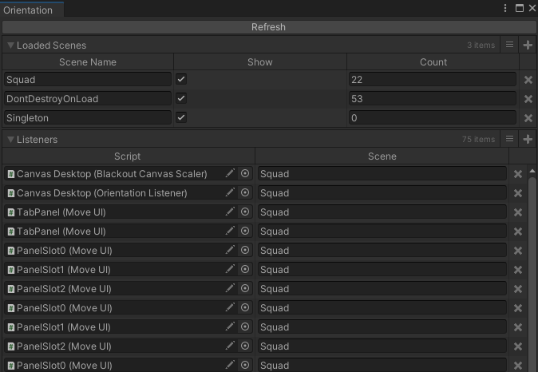
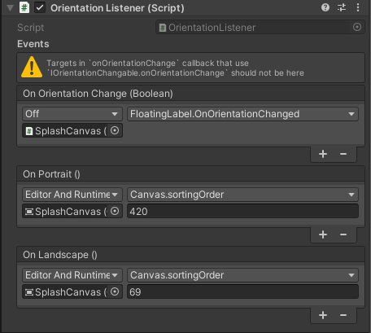

# Overview
Unity currently doesn't have any events to subscribe to for device orientation changes, so this is our solution. 

# Orientation

Any custom script you wish to be receive by orientation events it needs to implement `IOrientationChangeable` which implements one method `OrientationChanged(bool isPortrait)`.

# MoveUI

`MoveUI` implements the `IOrientationChangeable` and is helpful for changing any `RectTransform` properties during runtime or edit mode.

# Orientation Window

`OrientationWindow` in `Blackout > Window > Orientation Window` shows all the components that implement `IOrientationChangeable` in all currently loaded scenes with the count of how many scripts are in each scene. It will also scan the PrefabStage while in prefab editing mode. You can also filter the list by toggling `Show` next to the scene. 

Note: You need to press the `Refresh` button each time you want the list to up date. This is just to limit performance overhead.

# Orientation Listener

`OrientationListener` is a `MonoBehaviour` that is good for doing generic orientation tasks like enable/disable gameObjects or changing sprites or whatever a `MoveUI` doesn't do. This just helps limit custom scripts for doing a one off or edge case orientation specific things.

Note: `OnOrientationChange` serialised event will log and display a warning if a script is added to the event callback list that uses `IOrientationChangeable.OnOrientationChanged` and will set the execution state to `Off`. This is harmless but unnecessary as `IOrientationChangeable` will already be called but the `Orientation` system.

